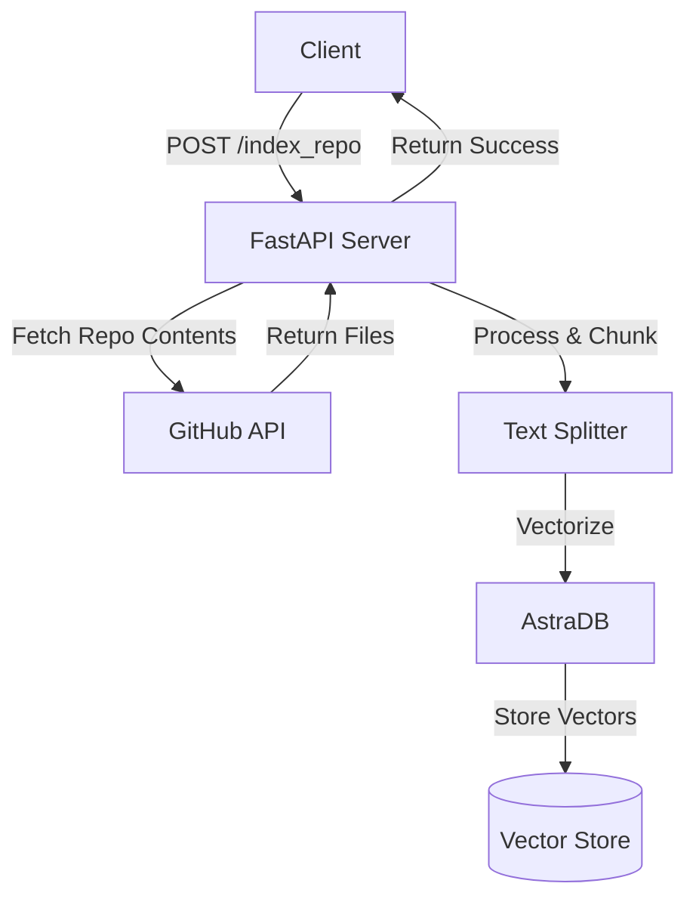
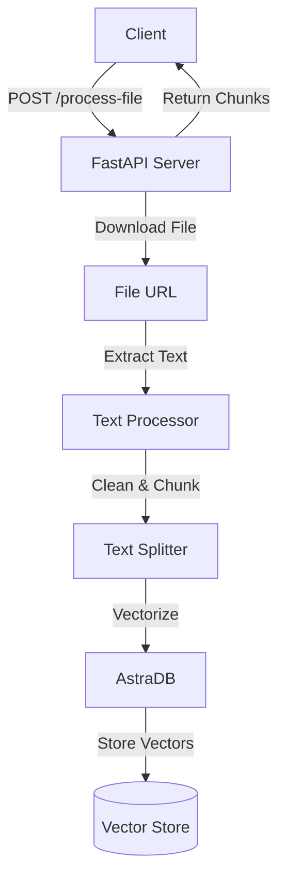

# 🤖 RAG AI Service Documentation

## Overview
This service provides a Retrieval-Augmented Generation (RAG) system built with FastAPI that enables:
- Repository code indexing and searching
- Document processing and querying
- Integration with Gemini AI for intelligent responses
- Vector storage using AstraDB

## 🔄 Architecture Flow

### Repository Indexing Flow


### Document Processing Flow


## 🛠️ API Endpoints

### 1. Index Repository
Indexes a GitHub repository's code files into AstraDB.

**Endpoint:** `POST /index_repo`

**Query Parameters:**
- `repo_url` (string, required): GitHub repository URL

**Example Request:**
```bash
curl -X POST "http://your-domain/index_repo?repo_url=https://github.com/username/repo"
```

**Success Response:**
```json
{
    "message": "Repository indexed successfully"
}
```

**Error Response:**
```json
{
    "detail": "Error message description"
}
```

### 2. Search and Answer Code Questions
```markdown
POST /search_and_answer
```
Searches indexed repository content and generates AI-powered answers.

**Request Body:**
```json
{
    "query": "string",
    "repo": {
        "repoUrl": "string",
        "structure": "string"
    }
}
```

**Response:**
```json
{
    "ans": "AI-generated answer in markdown format"
}
```

### 3. Process Document
```markdown
POST /process-file/
```
Processes and indexes external documents (PDF, DOCX, TXT).

**Request Body:**
```json
{
    "file_url": "string"  // URL of the document to process
}
```

**Response:**
```json
{
    "chunks": [
        {
            "fileurl": "string",
            "chunk_content": "string",
            "chunk_number": "integer"
        }
    ]
}
```

### 4. Query Document
Queries processed documents and generates AI-powered responses.

**Endpoint:** `POST /query-document`

**Query Parameters:**
- `query` (string, required): Question about the document content

**Example Request:**
```bash
curl -X POST "http://your-domain/query-document?query=What%20are%20the%20main%20findings?"
```

**Success Response:**
```json
{
    "answer": "Markdown formatted answer with relevant document excerpts"
}
```

## 🔧 Helper Functions

### `clean_text(text: str) -> str`
Cleans and normalizes text input.
- Removes extra spaces and newlines
- Removes non-ASCII characters
- Returns cleaned text

### `extract_text_from_file(url: str) -> str`
Extracts text content from various file formats.
- Supports PDF, DOCX, and TXT files
- Handles different MIME types
- Returns extracted text content

### `fetch_and_chunk(api_url: str, repo_url: str) -> list`
Fetches and processes GitHub repository contents.
- Recursively fetches files and directories
- Filters code files by extension
- Splits content into chunks
- Returns list of document chunks with metadata

## 🔐 Configuration Requirements

```python
# Required Environment Variables
ASTRA_DB_APPLICATION_TOKEN = "your-astra-db-token"
ASTRA_DB_API_ENDPOINT = "your-astra-db-endpoint"
GITHUB_TOKEN = "your-github-token"
GEMINI_API_KEY = "your-gemini-api-key"
```

## 🎯 CORS Configuration

The service supports CORS with the following default configuration:
```python
origins = [
    "http://localhost",
    "http://localhost:3000",
    "https://example.com",
    "*"  # Not recommended for production
]
```

## 🔄 Vector Storage Schema

### Code Repository Collection
```markdown
{
    "name": "src_url={blob_url} =>chunk_no={chunk_no}",
    "$vectorize": "cleaned_code_chunk"
}
```

### Document Collection
```markdown
{
    "name": "filename={filename} src_url={file_url} =>chunk_no={chunk_number}",
    "$vectorize": "cleaned_document_chunk"
}
```

## ⚠️ Error Handling

The service implements comprehensive error handling:
- Invalid file types
- Failed GitHub API requests
- Vector storage operations
- AI model generation errors

All errors are returned with appropriate HTTP status codes and descriptive messages.

## 🚀 Getting Started

1. Set up required environment variables
2. Install dependencies
3. Start the FastAPI server
4. Use the endpoints to index repositories or documents
5. Query the indexed content using natural language

## 📝 Notes

- The service uses Gemini 1.5 Flash 8B model for AI responses
- Repository indexing ignores certain paths (node_modules, packages, etc.)
- Document chunks are limited to 500 characters with no overlap
- Responses are formatted in Markdown with emojis for better readability
