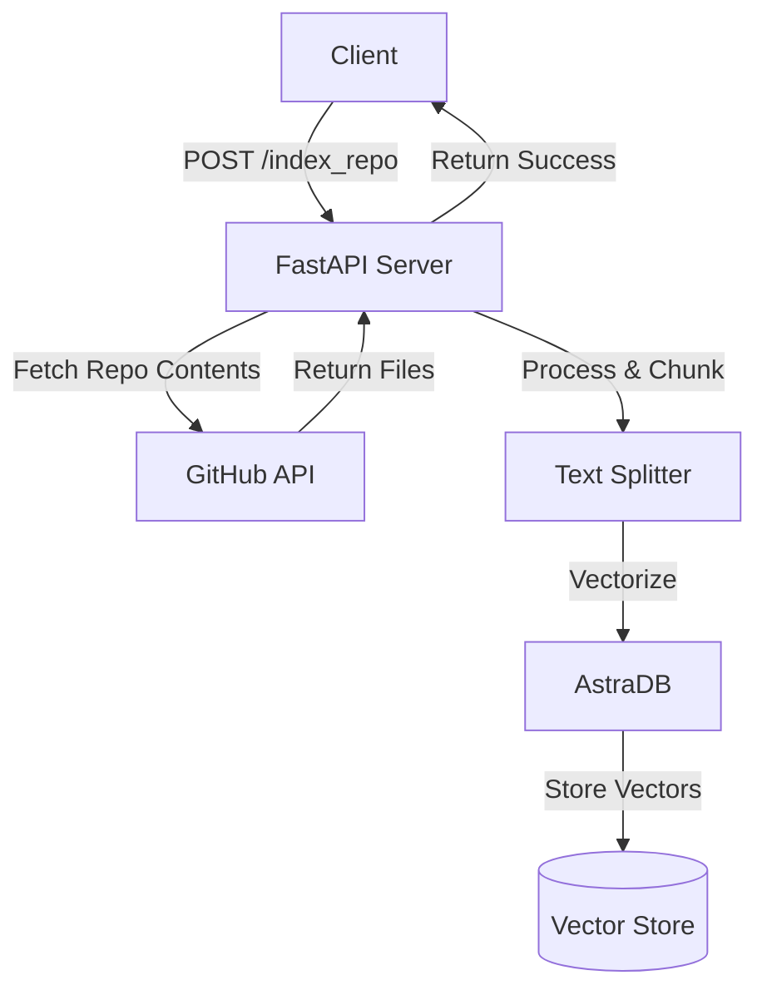
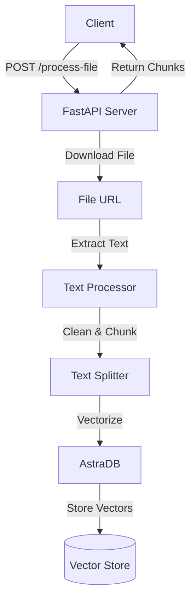
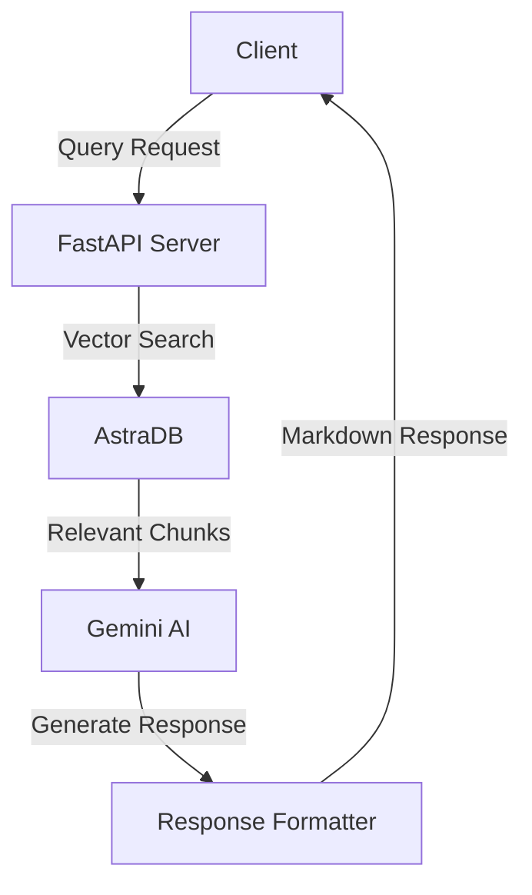

# 🤖 RAG AI Service Documentation


https://github.com/user-attachments/assets/de732828-c699-498a-ba4d-d691cf34b42d


https://github.com/user-attachments/assets/9314b8d6-9871-4dd9-87aa-3ef49a8738e9


## Table of Contents
- [Overview](#overview)
- [Architecture Flow](#architecture-flow)
  - [Repository Indexing Flow](#repository-indexing-flow)
  - [Document Processing Flow](#document-processing-flow)
  - [Query Processing Flow](#query-processing-flow)
- [API Endpoints](#api-endpoints)
  - [2. Search and Answer Code Questions](#2-search-and-answer-code-questions)
  - [3. Process Document](#3-process-document)
  - [4. Query Document](#4-query-document)
- [Helper Functions](#helper-functions)
  - [Text Processing](#text-processing)
  - [File Processing](#file-processing)
  - [Repository Processing](#repository-processing)
- [Configuration](#configuration)
  - [Environment Variables](#environment-variables)
  - [CORS Configuration](#cors-configuration)
- [Vector Storage](#vector-storage)
  - [Collection Schemas](#collection-schemas)
  - [Indexing Configuration](#indexing-configuration)
- [Error Handling](#error-handling)
  - [Common Error Scenarios](#common-error-scenarios)
  - [Error Response Format](#error-response-format)
- [Getting Started](#getting-started)
- [Best Practices](#best-practices)
  - [Repository Indexing](#repository-indexing)
  - [Document Processing](#document-processing)
  - [Querying](#querying)
  - [Performance Optimization](#performance-optimization)
  - [Security Considerations](#security-considerations)
- [Limitations](#limitations)


## Overview
This service provides a Retrieval-Augmented Generation (RAG) system built with FastAPI that enables:

- 📚 Multi-format document support (PDF, DOCX, TXT)
- 💻 GitHub repository code indexing
- 🔍 Semantic search capabilities
- 🤖 AI-powered response generation
- 🔄 Efficient chunking and vectorization

## Architecture Flow

### Repository Indexing Flow


### Document Processing Flow


### Query Processing Flow


## API Endpoints


### 2. Search and Answer Code Questions
Searches indexed repository content and generates AI-powered answers.

**Endpoint:** `POST /search_and_answer`

**Request Body:**
```json
{
    "query": "How does the authentication system work?",
    "repo": {
        "repoUrl": "https://github.com/username/repo",
        "structure": "repository_structure_string"
    }
}
```

**Success Response:**
```json
{
    "ans": "Markdown formatted answer with code examples and explanations"
}
```

### 3. Process Document
Processes and indexes external documents.

**Endpoint:** `POST /process-file/`

**Request Body:**
```json
{
    "file_url": "https://example.com/document.pdf"
}
```

**Success Response:**
```json
{
    "chunks": [
        {
            "fileurl": "https://example.com/document.pdf",
            "chunk_content": "Text content...",
            "chunk_number": 1
        }
    ]
}
```

### 4. Query Document
Queries processed documents and generates AI-powered responses.

**Endpoint:** `POST /query-document`

**Query Parameters:**
- `query` (string, required): Question about the document content

**Example Request:**
```bash
curl -X POST "http://your-domain/query-document?query=What%20are%20the%20main%20findings?"
```

**Success Response:**
```json
{
    "answer": "Markdown formatted answer with relevant document excerpts"
}
```

## Helper Functions

### Text Processing
```python
def clean_text(text: str) -> str:
    """
    Cleans and normalizes text input.
    
    Args:
        text (str): Input text
        
    Returns:
        str: Cleaned text
    """
    # Removes extra spaces, newlines, and non-ASCII characters
    return cleaned_text
```

### File Processing
```python
def extract_text_from_file(url: str) -> str:
    """
    Extracts text from various file formats.
    
    Supported formats:
    - PDF
    - DOCX
    - TXT
    
    Args:
        url (str): File URL
        
    Returns:
        str: Extracted text
    """
    return extracted_text
```

### Repository Processing
```python
def fetch_and_chunk(api_url: str, repo_url: str) -> list:
    """
    Processes GitHub repository contents.
    
    Args:
        api_url (str): GitHub API URL
        repo_url (str): Repository URL
        
    Returns:
        list: Document chunks with metadata
    """
    return documents
```

## Configuration

### Environment Variables
```bash
# Required Environment Variables
ASTRA_DB_APPLICATION_TOKEN=your-astra-db-token
ASTRA_DB_API_ENDPOINT=your-astra-db-endpoint
GITHUB_TOKEN=your-github-token
GEMINI_API_KEY=your-gemini-api-key
```

### CORS Configuration
```python
origins = [
    "http://localhost",
    "http://localhost:3000",
    "https://example.com",
    "*"  # Not recommended for production
]
```

## Vector Storage

### Collection Schemas

#### Code Repository Collection
```json
{
    "name": "src_url={blob_url} =>chunk_no={chunk_no}",
    "$vectorize": "cleaned_code_chunk"
}
```

#### Document Collection
```json
{
    "name": "filename={filename} src_url={file_url} =>chunk_no={chunk_number}",
    "$vectorize": "cleaned_document_chunk"
}
```

### Indexing Configuration
- Chunk size: 500 characters
- Chunk overlap: 0 characters
- Vector dimension: 1024
- Vector metric: DOT_PRODUCT
- Provider: NVIDIA
- Model: NV-Embed-QA

## Error Handling

### Common Error Scenarios
1. Invalid File Types
```json
{
    "detail": "Unsupported file type"
}
```

2. GitHub API Errors
```json
{
    "detail": "Unable to access repository: [error details]"
}
```

3. Vector Storage Errors
```json
{
    "detail": "Error storing vectors: [error details]"
}
```

### Error Response Format
All errors follow the structure:
```json
{
    "detail": "Error message"
}
```

## Getting Started

1. **Environment Setup**
```bash
# Clone the repository
git clone [repository-url]

# Install dependencies
pip install -r requirements.txt

# Set environment variables
export ASTRA_DB_APPLICATION_TOKEN=your-token
export ASTRA_DB_API_ENDPOINT=your-endpoint
export GITHUB_TOKEN=your-github-token
export GEMINI_API_KEY=your-gemini-key
```

2. **Start the Server**
```bash
uvicorn main:app --reload
```

3. **Test the API**
```bash
# Index a repository
curl -X POST "http://localhost:8000/index_repo?repo_url=https://github.com/username/repo"

# Process a document
curl -X POST "http://localhost:8000/process-file/" \
    -H "Content-Type: application/json" \
    -d '{"file_url": "https://example.com/document.pdf"}'
```

## Best Practices

### Repository Indexing
- Index smaller repositories first
- Avoid repositories with large binary files
- Use specific repository paths when possible

### Document Processing
- Ensure documents are publicly accessible
- Keep documents under 100MB
- Use PDF or DOCX for formatted content
- Use TXT for plain text content

### Querying
- Be specific in queries
- Reference file names when known
- Use context-specific terminology

### Performance Optimization
- Regular collection cleanup
- Monitor vector storage usage
- Cache frequent queries
- Use batch processing for large repositories

### Security Considerations
- Secure API endpoints
- Validate file URLs
- Implement rate limiting
- Monitor API usage
- Sanitize user inputs

## Limitations
- Maximum file size: 100MB
- Supported file types: PDF, DOCX, TXT
- Maximum query length: 1000 characters
- Rate limits: 100 requests per minute
- Vector dimension: 1024
- Maximum chunks per document: 1000

